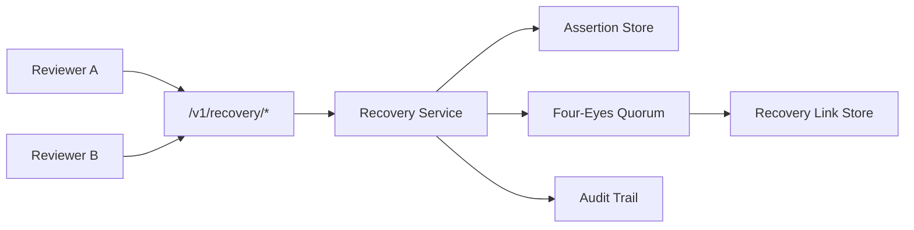

# SANRI OS Backend API Foundation

## Karar

Yeni istemci sözleşmesi `/v1` altında, mevcut SANRI route'larından izole edilir.
Mobil ve web istemcileri yalnızca SANRI API'ye bağlanır; model sağlayıcısı API
anahtarı hiçbir zaman istemciye gönderilmez.

## Dikey akış

1. İstemci Supabase Auth access token'ı `Authorization: Bearer <jwt>` ile gönderir.
2. API JWT'yi Supabase JWT secret ile doğrular ve `sub` claim'ini kullanıcı kimliği
   olarak kullanır.
3. API konuşma ve mesaj sahipliğini her sorguda `user_id` filtresiyle kontrol eder.
4. `AuraEngine`, versiyonlu AURA talimatını ve izin verilmiş hafıza özetini oluşturur.
5. `OpenAIProvider`, `AIProvider` protokolü üzerinden Responses API'yi çağırır.
6. Delta'lar streaming olarak istemciye aktarılır; tamamlanan kullanıcı ve asistan
   mesajları veritabanına yazılır.
7. Sağlayıcı metrikleri (token, süre, tahmini maliyet) yalnızca hassas içerik olmadan
   loglanır.

## Neden mevcut kodu taşımıyoruz?

`sanri-api` bugün yerel `users` tablosu ve HS256 uygulama token'ı kullanan çok sayıda
çalışan route içeriyor. Bu foundation, mevcut davranışı silmeden yeni Supabase Auth
tabanlı sözleşmeyi `/v1` ile başlatır. Geçiş tamamlandığında eski route'lar ayrıca
değerlendirilebilir.

## Veri ve güvenlik

- Yeni foundation tabloları `user_id UUID` taşır ve Supabase `auth.users(id)` ile
  ilişkilidir.
- RLS tüm foundation tablolarında aktiftir.
- API, connection pool üzerinden çalıştığı için uygulama katmanındaki sahiplik
  filtresi RLS'nin tamamlayıcısıdır; istemciye `service_role` anahtarı verilmez.
- Hafıza yalnızca `memory_consent=true` gönderildiğinde kaydedilir.
- Ham kullanıcı/yanıt metni loglanmaz; yalnızca kimliksiz metrikler loglanır.

## Gelecek genişlemeleri

`AIProvider` arayüzü OpenAI dışındaki veya self-hosted sağlayıcıları eklemek için
tek değişim noktasıdır. `mode` alanı ilk olarak `aura` ve `reflection` değerlerini
destekler; karakter/mod sistemi genişletilebilir.

## Sprint 3 — SANRI Unification

Sprint 3 bir feature sprinti değildir. Yeni ekran, yeni kullanıcı özelliği veya
yeni AI yeteneği eklenmez. Amaç legacy ve V1 sistemlerini tek bir davranış
kaynağında birleştirmektir.

### Katmanlar

```text
Client / Interface
        ↓
Application
        ↓
Domain
        ↑
Infrastructure
```

Domain katmanı framework bağımsız SANRI kavramlarını ve kurallarını taşır:
`User`, `Conversation`, `Memory`, `Consent`, `Project`, `Task`, `Knowledge`,
`Intent`, `Mode` ve `Session`. FastAPI route'ları, SQLAlchemy modelleri, JWT,
SSE ve provider SDK'ları domain'e bağımlı olabilir; domain bunlara bağımlı
olamaz.

### Tek orkestrasyon akışı

```text
Client → V1 API veya Compatibility Adapter
       → Application Chat Service
       → AURA Engine
       → AIProvider
       → LLM
```

Legacy orchestrator artık ikinci bir orchestration sistemi değildir. Geçiş
süresince yalnızca compatibility adapter olarak kalabilir; yeni prompt,
memory, intent veya provider kuralı içeremez.

### P0 kararları

1. Tek AURA orchestrator
2. `v1_memories` tek kalıcı memory kaynağı
3. Tek Prompt Builder
4. Mobil, web ve future desktop için tek V1 API
5. Legacy freeze: yalnızca bug fix, security, migration ve compatibility

Bu kararların ayrıntıları [`docs/adr/`](adr/README.md) altında tutulur.

### Runtime schema yönetimi

Production schema değişiklikleri Alembic migration'larıyla yönetilir.
Uygulama başlangıcında koşulsuz `Base.metadata.create_all()` kullanımı
production migration governance ile uyumlu değildir ve ayrıca değerlendirilip
kaldırılmalıdır.

## PMP-01A.3 — Manual Recovery Security Core

**Freeze tag:** `pmp01a34-complete` (A.3.1–A.3.4)  
**Status:** Security core complete; Recovery UI deferred  
**Principle:** UI is a thin client. Never move policy into the client. All
authorization, quorum evaluation, link validity, revoke rules and state
transitions remain server-side.

### Authority chain



| Package | Responsibility | Evidence |
|---|---|---|
| A.3.1 | Reviewer API + JWT/role gate | `tests/test_pmp01a31_reviewer_api.py` |
| A.3.2 | Durable signed assertions | `tests/test_pmp01a32_assertion_store.py` |
| A.3.3 | Four-eyes workflow enforcement | `tests/test_pmp01a33_four_eyes_workflow.py` |
| A.3.4 | Recovery link create/revoke lifecycle | `tests/test_pmp01a34_recovery_link_lifecycle.py` |

### Explicitly not in this freeze

- Recovery UI
- Identity migration / automatic linking
- Rollout / release gate open
- `PMP-01A-BLK-001` resolution

### Rollback

Return to tag `pmp01a34-complete` before any Recovery UI work. Do not weaken
server-side quorum, hash-only secrets, or audit-transaction bounds to unblock UI.
