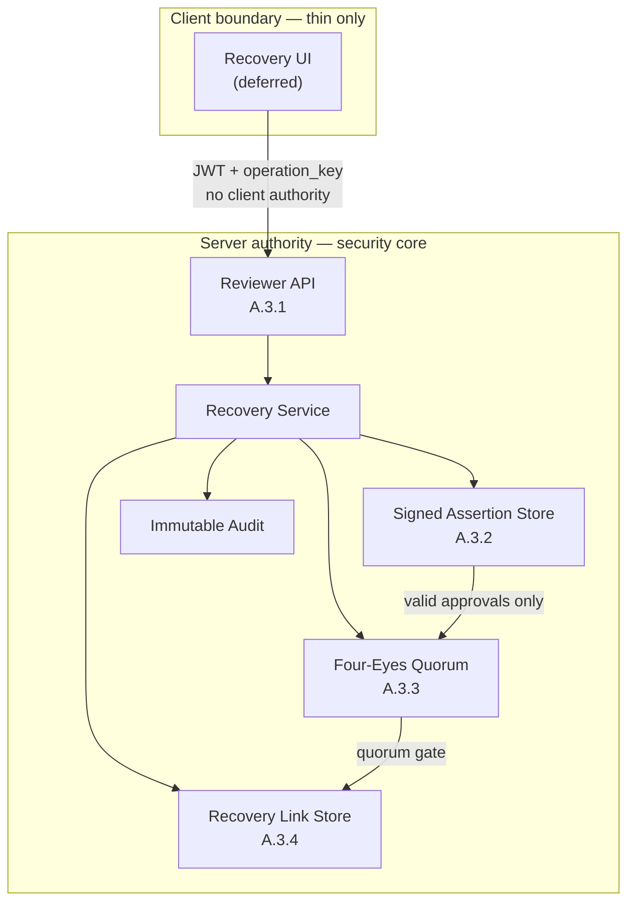

# PMP-01 Secure Migration Execution Plan

**Status:** Planned — pre-implementation  
**Program:** SANRI Product Maturation Program  
**Owner:** PMP-01.0 Program Governance  
**Governance:** SCA v1.0, SDS, SLS, Release Constitution  
**Product KPI:** Measured User Value (MUV)  
**Technical confidence view:** Migration Confidence Score (MCS)  

## Current execution status

**PMP-01A status:** `BLOCKED`  
**Blocker:** `VERIFIED_LEGACY_IDENTITY_SOURCE_MISSING`  
**Security impact:** Cross-user association and account takeover risk

### Official status snapshot

| Item | Status |
|---|---|
| PMP-01A | `BLOCKED` |
| Blocker | `VERIFIED_LEGACY_IDENTITY_SOURCE_MISSING` |
| Release gate | `CLOSED` |
| Automatic linking | `DISABLED` |
| Manual recovery | `POLICY_DEFINED / NOT_OPERATIONAL` (A.3.1–A.3.4 `EVIDENCE_READY`; Recovery UI deferred) |
| Security core freeze tag | `pmp01a34-complete` |
| Web event contract | `NOT_VERIFIABLE` (PMP-01A.2 closed) |
| Legacy reachable UX | Contained by PMP-01A.1; residual deep-links fail closed |
| PMP-01B | `NOT_STARTED` |

## PMP-01A.1 — Reachable Legacy Ask Surface Containment

**Status:** Active execution  
**Does not resolve:** `PMP-01A-BLK-001`  
**Does not enable:** linking, migration, rollout, release gate

### Problem

Reachable product surfaces still call fail-closed `/bilinc-alani/*`. Backend 401
is secure, but continuous failure on reachable UX is not product-ready.

### Evidence

- Client transport rejects any `/bilinc-alani/` request before network I/O with
  an explicit product message.
- Primary navigation entry points (`gates` SANRI, `my_area` deepen, city
  detail) route to authenticated `/(tabs)/chat` instead of `sanri_flow`.
- Legacy helper `askSanri` is fail-closed.
- Rollout percentages and automatic linking remain disabled.

### Exit

- No reachable primary entry point lands users on legacy ask without an
  explicit product fallback message.
- Containment does not invent identity proof or bypass `PMP-01A-BLK-001`.
- Release gate remains closed until remaining open risks are also closed.

### PMP-01A.1 completion record

| Field | Result |
|---|---|
| Package | PMP-01A.1 Reachable Legacy Ask Surface Containment |
| Package status | Ready to commit / contained |
| PMP-01A overall | Still `BLOCKED` (`PMP-01A-BLK-001`) |
| Release gate | Still `CLOSED` |
| Verification | `tsc --noEmit` pass; changed-file ESLint clean for containment files |
| Residual | Direct deep-links to hidden legacy screens still fail closed with product message; web event contract still `NOT_VERIFIABLE` |

PMP-01A.1 may complete without completing PMP-01A. The parent workstream remains
blocked until verified legacy identity source and remaining open risks close.

## PMP-01A.2 — Web Event Contract Audit

**Status:** Closed — `NOT_VERIFIABLE`  
**Does not resolve:** `PMP-01A-BLK-001`  
**Does not enable:** linking, migration, rollout, release gate

### Problem

Web event producer’ın canonical identity contract’ına uyumu doğrulanamıyor.

### Evidence required

- Inspectable web source tree mevcuttur (`package.json` + application source).
- Event producer bulunmuş ve incelenmiştir.
- `user_id`, `X-User-Id`, legacy token veya shared session identity olarak
  kullanılmadığı kanıtlanmıştır.
- Contract, backend `/events/log` gereksinimleriyle birebir uyumludur.

### Exit outcomes

| Result | Meaning | Consequence |
|---|---|---|
| `PASS` | Canonical contract verified | Evidence added to REP; risk closed |
| `FAIL` | Unsafe identity/session signals found | Open a containment package; release gate stays closed |
| `NOT_VERIFIABLE` | Inspectable source unavailable | Release gate remains closed; no trust assumed |

Rule: **kanıt yoksa güven de yok.** There is no fourth outcome such as
“probably correct.” Absence of source is not a pass.

### Execution record

First step performed: verify inspectable source existence (not code review).

Checkout audited: `C:\sanri\asksanri-frontend`  
Git HEAD: `65bf29a`  
Remote: `https://github.com/CaelinusAl/asksanri-frontend.git`

Observed root contents:

- present: `.git`, `.vite`, `dev-dist`, `dist`, `node_modules`, `public`, `.env`
- absent: `package.json`, `src/`, `app/`

Search for `events/log`, `X-User-Id`, and `mobile-default` outside build and
dependency directories returned no matches. This is not evidence of safety;
it is evidence that producer source is unavailable for audit.

### Exit decision

**Result:** `NOT_VERIFIABLE`  
**Reason:** Inspectable application source is not present.  
**Release gate:** remains `CLOSED`  
**PMP-01A-BLK-001:** unchanged  
**Assumption forbidden:** web producer is not presumed compliant.

PMP-01A.2 is closed with this status. Re-opening requires a restored
inspectable source tree and a new audit under the same PASS/FAIL/
NOT_VERIFIABLE model.

## PMP-01A.3 — Manual Recovery Execution

**Status:** `IMPLEMENTATION_READY`  
**Gate passed:** Contract → Edge-Case Review → IMPLEMENTATION_READY  
**First implementation target after this gate:** Reviewer API  
**Does not automatically resolve:** `PMP-01A-BLK-001`  
**Does not enable:** automatic linking, migration, rollout, release gate

### Problem

Manual recovery politikası tanımlı, ancak operasyonel olarak uygulanamıyor.
Güvenilir reviewer onayı, imzalı assertion, four-eyes kontrolü ve audit
zinciri bulunmadığı için verified identity link üretilemez.

### Evidence required

- Reviewer API çalışıyor.
- Signed Assertion Store mevcut.
- Four-eyes onayı zorunlu.
- Audit kaydı immutable.
- Recovery UI yalnızca yetkili akışı kullanıyor.
- Negatif güvenlik testleri geçiyor.

### Exit for PMP-01A.3 package

Manual recovery `OPERATIONAL` sayılır yalnızca şu koşulların tamamı
sağlandığında:

- Manual recovery tamamen operasyonel.
- Ad-hoc DB müdahalesi gerekmiyor.
- Verified identity link yalnızca recovery akışı üzerinden üretilebiliyor.
- Tüm kararlar audit ediliyor.
- REP için doğrulanabilir kanıt üretilmiş.

Until then, status remains `POLICY_DEFINED / NOT_OPERATIONAL`. No recovery
path may create `verified` or `linked` identity states through automation or
ad-hoc database edits.

### Target operational chain

```text
Policy
  → Reviewer API                         (A.3.1 EVIDENCE_READY)
  → Signed Assertion Store               (A.3.2 EVIDENCE_READY)
  → Four-eyes Approval                   (A.3.3 EVIDENCE_READY)
  → Recovery Link Lifecycle              (A.3.4 EVIDENCE_READY / frozen at pmp01a34-complete)
  → Immutable Audit Trail                (embedded in A.3.1–A.3.4 mutations)
  → Recovery UI                          (next — thin client only)
  → Operational Capability
```

Any missing link keeps the package incomplete.

### Security core architecture (A.3.1–A.3.4)

Server is the sole authority. Recovery UI (next) is a thin client: display state,
start reviewer operations, show results. Policy, quorum, link validity, revoke
rules, and state transitions never move into the client.



### Separation: package completion ≠ blocker resolution

Completing PMP-01A.3 does **not** automatically mark PMP-01A as `DONE`.

The open blocker remains:

`PMP-01A-BLK-001 / VERIFIED_LEGACY_IDENTITY_SOURCE_MISSING`

Required sequence:

```text
PMP-01A.3
    ↓
Evidence pack
    ↓
Resolution Review (separate decision)
    ↓
BLOCKED or UNBLOCKED
```

Resolution Review asks only:

> Does operational manual recovery now satisfy the blocker resolution
> criteria?

That decision is not made by the A.3 implementation authors alone. Evidence
producers and blocker-removal authority remain separated. A.3 may produce
capability evidence; only Resolution Review may change the blocker state.

### Operational contract (concrete)

Contract work order: State Machine → Assertion Schema → Four-Eyes Workflow →
Audit Boundary → Non-Goals → Authority Matrix. Implementation code starts only
after these sections are locked.

#### 1. State Machine

Case lifecycle states:

| State | Meaning |
|---|---|
| `DRAFT` | Case opened; evidence collection not complete |
| `EVIDENCE_PENDING` | Waiting for acceptable evidence package |
| `READY_FOR_REVIEW` | Evidence hashed; awaiting first reviewer assertion |
| `AWAITING_SECOND_APPROVAL` | First reviewer asserted; second reviewer required |
| `APPROVED` | Four-eyes quorum met; link not yet created |
| `LINK_CREATED` | Recovery Service created identity link |
| `REJECTED` | Terminal — case denied |
| `CANCELLED` | Terminal — requester/system cancelled before approval |
| `EXPIRED` | Terminal — assertion or case timeout |
| `REVOKED` | Terminal after link — recovery revocation completed |
| `CLOSED` | Terminal administrative close after notification/retention start |

Allowed transitions:

```text
DRAFT
  → EVIDENCE_PENDING
  → CANCELLED

EVIDENCE_PENDING
  → READY_FOR_REVIEW
  → REJECTED
  → CANCELLED
  → EXPIRED

READY_FOR_REVIEW
  → AWAITING_SECOND_APPROVAL
  → REJECTED
  → CANCELLED
  → EXPIRED

AWAITING_SECOND_APPROVAL
  → APPROVED
  → REJECTED
  → EXPIRED
  → CANCELLED

APPROVED
  → LINK_CREATED
  → EXPIRED
  → CANCELLED   (only before link transaction commits)

LINK_CREATED
  → REVOKED
  → CLOSED

REJECTED | CANCELLED | EXPIRED | REVOKED | CLOSED
  → (no further transitions except CLOSED retention housekeeping)
```

Terminal states: `REJECTED`, `CANCELLED`, `EXPIRED`, `REVOKED`, `CLOSED`.

Timeout / cancellation:

- Case without progress expires after a configured TTL (default proposal:
  14 days from last state change).
- Assertions expire independently; expired assertion cannot approve.
- Cancellation is allowed only before `LINK_CREATED`.
- After `LINK_CREATED`, only revoke or close paths apply.
- Appeals create a **new** case; they never reopen a terminal case in place.

Illegal transitions fail closed and produce an immutable audit event.

#### 2. Assertion Schema

Required assertion fields:

| Field | Purpose |
|---|---|
| `assertion_id` | Unique assertion identifier |
| `case_id` | Parent recovery case |
| `operation_key` | Idempotency key for the decision |
| `policy_version` | Governance policy version applied |
| `evidence_reference_hash` | Hash of reviewed evidence package |
| `asserted_supabase_user_id` | Canonical UUID under review |
| `asserted_legacy_user_id` | Legacy reference under review |
| `reviewer_id` | Authenticated reviewer principal |
| `reviewer_role` | `primary_reviewer` or `second_reviewer` |
| `decision` | `approve` / `reject` |
| `rationale_code` | Machine-readable reason code (no raw secrets) |
| `created_at` | Server timestamp |
| `expires_at` | Assertion validity end |
| `signature` | Server-side signature over canonical assertion payload |
| `revoked_at` | Null unless assertion revoked |

Who may sign:

- Only Recovery Service signs assertions after authenticating a reviewer.
- Clients and browsers never supply a trusted signature.
- Reviewers authenticate; they do not self-sign authority.

Validity:

- Assertions are short-lived (default proposal: 24 hours).
- Expired assertions cannot complete quorum.
- Approval quorum requires two non-expired, non-revoked approvals from
  distinct reviewers for the same `operation_key` and evidence hash.

Revocation / versioning:

- Assertion revocation is append-only (`revoked_at` set); records are not
  deleted.
- Policy version is immutable on an assertion; policy upgrades require a new
  case or new assertions.
- Schema version field may be added without rewriting history.

#### 3. Four-Eyes Workflow

Roles:

| Role | Authority |
|---|---|
| Primary Reviewer | Prepare case, create first approval/rejection assertion |
| Second Reviewer | Provide independent second approval/rejection |
| Recovery Service | Enforce quorum, create/revoke links, write audit |
| System | Clock, expiry, immutable audit persistence |

Conflict rules:

- Same principal cannot act as both primary and second reviewer on one case.
- Self-approval is forbidden.
- A reviewer who created the case may be primary reviewer, but cannot be
  second reviewer.
- Quorum = exactly two distinct approvals for approve path; one rejection by
  either authorized reviewer may terminate to `REJECTED` per policy.

#### 4. Audit Boundary

Immutable:

- Case state transitions
- Assertion create/revoke events
- Quorum decisions
- Link create/revoke outcomes
- Actor IDs, timestamps, operation keys, evidence hashes, policy versions

May be redacted (never deleted from integrity chain):

- Free-text support notes outside rationale codes
- Contact channel details after retention window, replaced by tombstone hash

Verification:

- Audit stream must allow reconstruction of who changed state, when, under
  which policy/evidence hash, and whether quorum was valid.
- Missing audit write aborts the business transaction.

#### 5. Non-Goals

- Automatic linking: forbidden
- Ad-hoc DB intervention as recovery path: forbidden
- Client assertions as authority: forbidden
- Legacy token decoder re-enablement as trust source: forbidden
- Email / device / IP / fingerprint matching as proof: forbidden
- Release gate opening as a side effect of A.3: forbidden
- Silent migration of user data during recovery: forbidden

#### 6. Authority Matrix

| Operation | Sole authority |
|---|---|
| Case create | Reviewer API |
| Assertion create | Reviewer (via Recovery Service signing) |
| Assertion approve (second eye) | Second Reviewer |
| Link create | Recovery Service |
| Link revoke | Recovery Service |
| Audit write | System |
| Case close | Recovery Service |

This matrix answers one question only: which single component is authorized
to perform each security-sensitive operation.

#### 7. Edge-Case Review (Contract Validation)

**Problem:** Normal akış tanımlı. Güvenlik açısından kritik sıra dışı
durumların beklenen davranışı henüz kilitlenmemişti.

**Exit for this review:** Every critical scenario has a deterministic,
fail-closed expected behavior; no new blocker was found.

| # | Scenario | Expected behavior |
|---|---|---|
| EC-01 | Two reviewers approve the same case concurrently | Single-winner compare-and-set on case state. Exactly one transition to `APPROVED` succeeds. The losing write fails closed with `conflict_state` / idempotent replay. Both assertion attempts are audited; only the winning quorum pair is used. |
| EC-02 | Primary assertion is revoked after first approval | Case returns to `READY_FOR_REVIEW` if still before quorum completion, or stays non-approved. Any second approval against a revoked primary assertion is rejected. Link creation is forbidden until a fresh valid quorum exists. |
| EC-03 | Link create attempted with expired assertion(s) | Recovery Service rejects with `assertion_expired`. Case moves to `EXPIRED` if no valid quorum remains, else remains waiting for valid assertions. No link row is written. |
| EC-04 | Second reviewer identity equals primary reviewer | Reject with `four_eyes_conflict`. No state advance. Audit records the forbidden attempt. |
| EC-05 | Audit write fails inside link/decision transaction | Entire transaction rolls back. Case state unchanged. No identity link is created. Failure audited by a best-effort system incident event if separate from the aborted write; business decision remains uncommitted. |
| EC-06 | Recovery Service restarts mid-flow | Resume by `operation_key` and case state only. Duplicate retries are idempotent: same `operation_key` returns the prior result; never creates a second link for the same pair. |
| EC-07 | Two open cases for the same legacy identity | Second open case is rejected with `duplicate_open_case` unless the first is terminal. Unique partial constraint: at most one non-terminal case per `legacy_user_id` and per `supabase_user_id`. |
| EC-08 | Reopen a terminal case | Forbidden. Appeals create a new case with a new `operation_key`. Terminal states never transition back to review states. |
| EC-09 | Evidence hash changes after first approval | Existing approvals become invalid for quorum. Case returns to `EVIDENCE_PENDING` or `READY_FOR_REVIEW` with reason `evidence_changed`. New assertions required. |
| EC-10 | APPROVED case expires before link commit | Transition to `EXPIRED`. Link create after expiry fails closed. A new case is required. |
| EC-11 | Conflicting mapping already linked/revoked in identity table | Link create fails closed with `identity_conflict` or `already_linked` / `revoked_link`. Case terminates `REJECTED` or stays `APPROVED` without link only if policy chooses reject; default: `REJECTED`. |
| EC-12 | Client submits a self-signed assertion body | Ignored as authority. Only Recovery Service-signed assertions count. Request fails closed with `client_assertion_forbidden`. |

Contract clarifications locked by this review:

1. Quorum evaluation and state transition share one transactional boundary
   with audit write.
2. At most one non-terminal recovery case per canonical UUID and per legacy
   identity reference.
3. Assertion revoke before quorum invalidates that assertion for all further
   decisions.
4. Idempotency key uniqueness is global for recovery operations.
5. Authority never becomes ambiguous under concurrency: Recovery Service is
   the sole serializer of case-state mutations.

**Edge-Case Review result:** `PASS` — no new blocker.  
**Package gate:** `IMPLEMENTATION_READY`.

Implementation order after this gate:

```text
Reviewer API                         (A.3.1 EVIDENCE_READY)
  → Signed Assertion Store           (A.3.2 EVIDENCE_READY)
  → Four-Eyes Workflow enforcement   (A.3.3 EVIDENCE_READY)
  → Recovery Link Lifecycle          (A.3.4 EVIDENCE_READY) ← freeze tag pmp01a34-complete
  → (next) Recovery UI — thin client only
```

`IMPLEMENTATION_READY` does not open the release gate, does not resolve
`PMP-01A-BLK-001`, and does not authorize production linking without the
later Resolution Review.

### PMP-01A.3.1 — Reviewer API implementation

**Status:** `EVIDENCE_READY`  
**Verification:** `pytest tests/test_pmp01a31_reviewer_api.py` — 13 passed  
**Parent:** PMP-01A.3 Manual Recovery Execution  
**UI:** deferred — must not precede transaction / security evidence  
**Does not resolve:** `PMP-01A-BLK-001`  
**Does not enable:** automatic linking, migration, rollout, release gate, Recovery UI  
**Persistence note:** A.3.1 uses an in-process case store for transactional proof; durable Signed Assertion Store is A.3.2.

#### Security bounds (minimum gate)

1. Reviewer identity is derived only from server-side JWT + role verification.
2. Client cannot supply reviewer identity or decision authority fields.
3. Every mutation requires `operation_key` and is idempotent on replay.
4. State transitions are allowed only via the locked A.3 state machine.
5. Audit write failure aborts the mutation; case state and assertions roll back.
6. Same person filling both reviewer roles is rejected (`four_eyes_conflict`).
7. Terminal cases are immutable.
8. Endpoints must not open rollout or create identity links.

#### Exit for A.3.1 (not “API works”)

Package exits only when negative security tests prove the bounds above:

| Evidence | Expected |
|---|---|
| Missing / invalid JWT | `401` |
| Authenticated non-reviewer | `403 reviewer_role_required` |
| Client-sent `reviewer_id` on assertion | request validation reject |
| Duplicate `operation_key` | idempotent replay (`replayed: true`) |
| Illegal transition | `409 illegal_transition` |
| Same reviewer twice | `409 four_eyes_conflict`; state unchanged |
| Audit writer failure | `audit_failed`; no committed case/assertion |
| Mutate after cancel/expire | `409 terminal_case_immutable` |
| Recovery routes | no link/rollout/automatic endpoints |

#### Non-goals for A.3.1

- Recovery UI
- Durable signed Assertion Store (next package)
- Link create / revoke path
- Opening release gate or unblocking PMP-01A

#### Implementation map

| Layer | Location |
|---|---|
| Domain state machine | `app/domain/recovery.py` |
| Transactional service | `app/application/recovery_service.py` |
| Reviewer JWT/role gate | `app/core/security.py` (`get_current_recovery_reviewer`) |
| HTTP surface | `app/api/routes/recovery.py` (`/v1/recovery/*`) |
| Negative evidence | `tests/test_pmp01a31_reviewer_api.py` |

### PMP-01A.3.2 — Durable Signed Assertion Store

**Status:** `EVIDENCE_READY`  
**Verification:** `pytest tests/test_pmp01a32_assertion_store.py` — 16 passed  
**Parent:** PMP-01A.3 Manual Recovery Execution  
**Does not resolve:** `PMP-01A-BLK-001`  
**Does not enable:** automatic linking, migration, rollout, release gate, Recovery UI, identity link create/revoke

#### Problem

A.3.1 proves reviewer API transaction bounds in-process. Operational recovery
still requires durable, server-signed assertions with append-only revoke and
quorum validity that excludes expired/revoked/forged rows.

#### Security bounds (minimum gate)

1. Only Recovery Service / assertion store signs; client signatures rejected
   (`client_assertion_forbidden`).
2. Client cannot supply reviewer authority fields into the store.
3. Required A.3 assertion schema fields are persisted, including
   `policy_version`, `evidence_reference_hash`, `signature`, `revoked_at`.
4. `operation_key` is unique and idempotent on replay.
5. Revocation is append-only (`revoked_at`); delete is forbidden.
6. `policy_version` is immutable on a stored assertion.
7. Expired or revoked approvals never complete quorum.
8. Missing signing secret fails closed (`signing_not_configured`).
9. Package must not create identity links or open rollout controls.

#### Contract clarifications applied

1. Each assertion has its own `operation_key` (idempotency). Quorum is evaluated
   on `case_id` + `evidence_reference_hash` with two distinct valid reviewers.
2. Decision values stored as `approve` / `reject` (canonical lowercase).

#### Exit for A.3.2 (not “store exists”)

| Evidence | Expected |
|---|---|
| Client-supplied signature | `client_assertion_forbidden`; no row |
| Client-supplied reviewer authority | `client_assertion_forbidden` |
| Tampered payload | signature verification false; excluded from quorum |
| Duplicate `operation_key` | idempotent replay |
| Same reviewer twice | `four_eyes_conflict` |
| After TTL | approvals excluded from quorum |
| Revoke | `revoked_at` set; row remains; quorum fails |
| Delete / policy mutate | `assertion_immutable` |
| Empty signing secret | `signing_not_configured`; no row |
| Migration | assertion table only; no link/rollout |

#### Non-goals for A.3.2

- Recovery UI
- Link create / revoke path
- Four-eyes workflow completion package beyond store-level role assignment
- Opening release gate or unblocking PMP-01A

#### Implementation map

| Layer | Location |
|---|---|
| Assertion domain | `app/domain/assertion.py` |
| Server signing | `app/application/assertion_signing.py` |
| Durable store | `app/application/assertion_store.py` |
| ORM model | `app/models/recovery_assertion.py` |
| Migration | `migrations/versions/20260718_0004_recovery_assertions.*` |
| Negative evidence | `tests/test_pmp01a32_assertion_store.py` |

### PMP-01A.3.3 — Four-Eyes Workflow Enforcement

**Status:** `EVIDENCE_READY`  
**Verification:** `pytest tests/test_pmp01a33_four_eyes_workflow.py` — 9 passed  
**Regression:** A.3.1 + A.3.2 suites remain green (39 total across A.3.1–A.3.3)  
**Parent:** PMP-01A.3 Manual Recovery Execution  
**Does not resolve:** `PMP-01A-BLK-001`  
**Does not enable:** identity link create/revoke, Recovery UI, migration, rollout, release gate

#### Problem

A.3.1 and A.3.2 proved API bounds and a durable signed store in isolation.
Recovery case mutations could still treat in-memory assertion lists as authority.
Four-eyes must be mandatory: store write → quorum check → case commit → audit,
with full rollback if audit fails.

#### Required flow

```text
Recovery Request
  → Mutation Start
  → Assertion #1 (reviewer A) → Assertion Store
  → Assertion #2 (reviewer B) → Assertion Store
  → Quorum Check
       ├── FAIL → reject / remain non-approved
       └── PASS → Recovery Mutation Commit → Audit
```

#### Security bounds (minimum gate)

1. Assertion mutations fail closed without the durable signed assertion store
   (`assertion_store_required`).
2. Same reviewer cannot fill both roles (`four_eyes_conflict`).
3. Assertion revoke drops quorum immediately; case returns to
   `READY_FOR_REVIEW` when still pre-quorum.
4. Expired assertions never satisfy workflow quorum.
5. Audit write failure rolls back both case state and durable assertion rows.
6. After restart, the same `operation_key` resumes idempotently from the store.
7. Quorum `APPROVED` does not create identity links or open rollout.

#### Exit for A.3.3

| Evidence | Expected |
|---|---|
| No assertion store wired | `assertion_store_required` |
| Same reviewer twice | `four_eyes_conflict`; one durable row |
| Revoke primary before second eye | state → `READY_FOR_REVIEW`; quorum false |
| Assertions past TTL | quorum false |
| Audit fail mid-assert | case unchanged; zero durable rows |
| Restart + replay `operation_key` | `replayed: true`; no duplicate row |
| Two distinct approvals | case → `APPROVED`; still no `LINK_CREATED` |

#### Non-goals for A.3.3

- Identity link create / revoke
- Recovery UI
- Migration / rollout / release gate / blocker resolution

#### Implementation map

| Layer | Location |
|---|---|
| Workflow service | `app/application/recovery_service.py` |
| API wiring (store required) | `app/api/routes/recovery.py` |
| Negative evidence | `tests/test_pmp01a33_four_eyes_workflow.py` |

### PMP-01A.3.4 — Recovery Link Lifecycle

**Status:** `EVIDENCE_READY` (completed — security core freeze)  
**Git tag:** `pmp01a34-complete`  
**Verification:** `pytest tests/test_pmp01a34_recovery_link_lifecycle.py` — 15 passed  
**Regression:** A.3.1–A.3.4 suites green (**54 passed**)  
**Parent:** PMP-01A.3 Manual Recovery Execution  
**Does not resolve:** `PMP-01A-BLK-001`  
**Does not enable:** Recovery UI, identity migration, automatic linking, rollout, release gate

#### Problem

Four-eyes quorum could reach `APPROVED` without an operational, auditable
recovery-link create/revoke path. Links must be server-issued, secret-hashed,
single-active, and transactionally audited.

#### Security bounds (minimum gate)

1. Quorum required before `create_recovery_link` (`APPROVED` + live store quorum).
2. Terminal cases cannot create links (`terminal_case_immutable`).
3. Revoked or expired assertions cannot satisfy quorum (`assertion_expired`).
4. Only one active recovery link per case (`active_link_exists`).
5. Secret stored hashed only; raw token never persisted.
6. Raw token returned once only on create; idempotent `operation_key` replay returns no token.
7. Audit and mutation share one transaction; audit failure rolls back everything.
8. Revoke requires reason; revoke is idempotent; `revoked_at` / `revoked_by` recorded.
9. Expired or used links never reactivate (`link_immutable`).
10. Assertion revoke after link create invalidates the active link in the same transaction.

#### Exit for A.3.4

| Evidence | Expected |
|---|---|
| No quorum / not `APPROVED` | no link row; fail closed |
| Expired assertions at create | `assertion_expired`; case → `EXPIRED`; no link |
| Terminal case create | `terminal_case_immutable` |
| Second active link | `active_link_exists` |
| Create success | case → `LINK_CREATED`; raw token once; DB has `token_hash` only |
| Replay `operation_key` | `replayed: true`; `raw_token` is `None` |
| Revoke without reason | `revoke_reason_required` |
| Revoke success | `revoked_at` / `revoked_by`; case → `REVOKED` |
| Audit fail on create/revoke | full rollback |
| Reactivate used/revoked | `link_immutable` |
| Migration | `v1_recovery_links` only; no identity/rollout tables |

#### Non-goals for A.3.4

- Recovery UI (next package — thin client; no policy in client)
- Identity migration / automatic linking
- Rollout percentage / release gate / blocker resolution

#### Implementation map

| Layer | Location |
|---|---|
| Link domain | `app/domain/recovery_link.py` |
| Durable link store | `app/application/recovery_link_store.py` |
| Lifecycle service | `app/application/recovery_service.py` (`create_recovery_link` / `revoke_recovery_link`) |
| ORM model | `app/models/recovery_link.py` |
| Migration | `migrations/versions/20260718_0005_recovery_links.*` |
| Negative evidence | `tests/test_pmp01a34_recovery_link_lifecycle.py` |

#### Freeze note

Security core A.3.1–A.3.4 is frozen at tag `pmp01a34-complete`. Next work makes
this core visible via Recovery UI without moving authorization, quorum, link
validity, revoke rules, or state transitions into the client.

### Execution discipline

Every subsequent package is reviewed with the same questions:

1. Problem net ve gerçek mi?
2. Evidence objektif ve doğrulanabilir mi?
3. Exit kriterleri tamamen karşılandı mı?
4. Blocker doğru yönetiliyor mu?
5. Release Gate durumu değişiyor mu?

If any answer is negative, the package status does not advance.

### Blocker metadata

| Field | Value |
|---|---|
| Blocker ID | `PMP-01A-BLK-001` |
| Title | Verified Legacy Identity Source Missing |
| Severity | Critical |
| Category | Identity / Security |
| Introduced | PMP-01A |
| Blocks | PMP-01B, PMP-01C, Context Engine, Project Engine, Production Migration |
| Owner | PMP-01 Program |

### Resolution criteria

`PMP-01A-BLK-001` yalnızca aşağıdaki koşulların tamamı sağlandığında
`RESOLVED` olarak işaretlenebilir:

- server-side verified legacy identity source exists,
- client-controlled identity hiçbir akışta authoritative değil,
- manual recovery policy execution akışına entegre,
- ilgili security tests geçer,
- approval, revoke ve audit implementasyonu doğrulanır,
- Release Council blocker resolution’ı kabul eder.

Blocker çözüm kararı ilgili REP ve Governance Health Check kayıtlarına
eklenmeden PMP-01B veya PMP-01C başlatılamaz.

## Legacy Identity Trust Model assessment

Mevcut legacy sistemde üç ayrı identity davranışı görülmektedir:

1. Canonical V1 Supabase JWT `sub` UUID’si server-side doğrulanabilir.
2. Legacy HS256 token üretimi tarihsel olarak mevcut olsa da decoder
   fail-closed durumdadır; aktif legacy session verifier yoktur.
3. Bazı legacy yollar hâlâ client-controlled `user_id`, `X-User-Id`,
   `device_fp` veya default session sinyallerini kabul etmektedir.

İncelenen kritik örnekler:

- `app/routes/events.py`: payload/header user identity ve
  `mobile-default` session kabul ediyor.
- `app/routes/activity.py`: auth guard olmadan integer `user_id` ile memory
  okuma/yazma yapıyor.
- `app/routes/device.py`: client-provided integer `user_id` ile user kaydı
  güncelliyor.
- `app/services/auth.py`: legacy token decoder bilinçli olarak `None`
  döndürüyor.
- `app/application/identity_linking.py`: yalnızca dry-run contract’ı;
  public route veya production write yok.
- `docs/sprint-3.2b-manual-recovery-governance.md`: manual recovery politikası
  mevcut, fakat execution workflow ve reviewer assertion store kodda yok.

### Trust model decision

Mevcut kanıta göre:

- **Server-side legacy verification:** bugün mevcut değil.
- **Manual-recovery-only:** mevcut governance ile uyumlu ve savunulabilir.
- **Automatic linking:** verified legacy proof ve uncontained client identity
  yolları nedeniyle iptal edilmiş olarak kalmalı.

Email, display name, device, IP, fingerprint, default session, client
`legacy_user_id` veya unsigned/custom token hiçbir şekilde identity proof
sayılmaz. `PMP-01A-BLK-001` bu nedenle implementasyon eksikliği değil, trust
model blocker’ıdır.

Bu bulgu aynı zamanda `events.py`, `activity.py`, `device.py` ve benzeri
legacy yolların identity/ownership kararlarında fail-closed yapılması veya
canonical doğrulama arkasına alınması gerektiğini gösterir. Bu containment
tamamlanmadan otomatik linking veya PMP-01B başlatılamaz.

## PMP-01A containment evidence / REP input

**Evidence status:** Prepared — containment review  
**Scope:** Untrusted legacy identity signal containment  
**Production migration:** Not enabled  
**Identity linking:** Not enabled  
**Rollout:** 0%

### Verification results

| Check | Result | Evidence |
|---|---|---|
| Backend full test suite | PASS — 83 passed, 6 skipped | `python -m pytest -q` |
| Targeted identity tests | PASS — included in full suite | `tests/test_legacy_identity_containment.py`, `tests/test_sprint32a_identity.py` |
| Mobile TypeScript | PASS | `npx tsc --noEmit` |
| Changed mobile files lint | PASS | `npx eslint lib/analytics.ts lib/LogEvent.ts lib/eventSession.ts` |
| Full mobile lint | BLOCKED by baseline | 16 errors, 34 warnings in unrelated existing files |
| Web event source audit | NOT VERIFIABLE | Source tree is not present in the inspected web checkout |

### Known warning

The backend suite emits one `PendingDeprecationWarning` from Starlette
`formparsers.py` because the installed compatibility import uses `multipart`
and recommends `python_multipart`. It is dependency-level, does not originate
in the containment files, and does not fail the suite. It remains a deferred
dependency maintenance item.

### Client contract verification

Mobile event consumers no longer send `user_id` or `X-User-Id`. They use the
Supabase access token and a persisted UUID event session from
`lib/eventSession.ts`. Legacy `mobile-default` event sessions are not sent.
Unauthenticated event ingestion fails closed and is handled as an offline
analytics failure.

The web source checkout could not be independently verified because it
contains built/runtime artifacts but no inspectable application source tree.
This is a remaining verification gap, not evidence that web usage is safe.

### Open risks retained for production

These are integration and UX risks. They do not block committing the
containment change, but they must remain open in REP and be resolved before
any release gate opens:

1. **Mobile lint baseline** — Full mobile lint still reports pre-existing
   errors/warnings unrelated to the containment files. Tracked separately;
   must not grow with new changes.
2. **Web event consumer unverified** — See assessment below. Release gate
   remains closed until the web source is available and audited.
3. **Legacy shared-session UX breakage** — See impact matrix below. Release
   gate remains closed until affected surfaces are migrated, disabled, or
   given a verified user-facing fallback.

### Risk assessment — legacy shared-session UX

Shared session IDs are not an event-ingestion-only problem. Multiple mobile
surfaces still call fail-closed legacy chat (`/bilinc-alani/ask`) with
shared or static `session_id` values.

| Surface | Session signal | Endpoint | User impact | Status |
|---|---|---|---|---|
| `sanri_flow.tsx` | `mobile-default` | `/bilinc-alani/ask` | Chat fails with canonical-identity required | REACHABLE via gates/city/my_area |
| `observer.tsx` | `mobile-default` | `/bilinc-alani/ask` | Same failure | Hidden from tab bar (`href: null`) |
| `pattern.tsx` | `mobile-default` | `/bilinc-alani/ask` | Same failure | Hidden from tab bar |
| `symbol.tsx` | `mobile-default` | `/bilinc-alani/ask` | Same failure | Hidden from tab bar |
| `lib/api.ts` `askSanri` | default `"mobile"` | `/bilinc-alani/ask` | Same failure for callers | Shared helper |
| `daily_stream.tsx` | `daily-stream-mobile` | `/bilinc-alani/ask` | Same failure | Active surface |
| `kod_ders.tsx` | `mobile-kod-okuma` | `/bilinc-alani/ask` | Same failure | Active surface |
| `rituals/live.tsx` | `"mobile"` | `/bilinc-alani/ask` | Same failure | Active surface |
| `my_area`, `world_events`, `okuma_detail`, `matrix_mini`, `global-signal` | various | `/bilinc-alani/ask` | Same failure | Active surfaces |
| Event analytics (`LogEvent` / `analytics`) | UUID + Supabase JWT | `/events/log` | Contained | CLOSED for this risk |

Verdict: changing only the string `"mobile-default"` does not restore these
screens. The trust boundary is correct — legacy chat is fail-closed — but
product surfaces still route users into that dead end. Before any release
gate opens, every reachable legacy ask surface must either:

- migrate to authenticated V1 chat, or
- be removed/hidden from navigation, or
- show an explicit, non-spoofable “canonical auth required” product state.

### Risk assessment — web event consumer

Inspected checkout `asksanri-frontend` currently contains:

- `dist/`, `dev-dist/`, `.vite/`, `node_modules/`, `public/`, `.env`
- no `package.json`
- no application `src/` tree

Search for `events/log`, `X-User-Id`, and `mobile-default` in non-build
paths returned no matches. This is **not** evidence that web is safe; it is
evidence that web source of truth is not present for audit.

Verdict: web event consumer status = `NOT VERIFIABLE`. Release gate remains
closed until an inspectable web source tree is restored and proven to:

- omit client-controlled `user_id` / `X-User-Id`,
- send Supabase JWT for authenticated event ingestion,
- never use shared/default session identifiers as identity.

### Manual-recovery-only executability assessment

Governance document:

- `docs/sprint-3.2b-manual-recovery-governance.md`

What exists:

- policy for acceptable/prohibited evidence,
- four-eyes approval rule,
- idempotency and revocation intent,
- dry-run identity link contracts (`app/application/identity_linking.py`),
- empty identity-link / migration-audit schema models.

What does **not** exist in executable code:

- reviewer case create/approve/reject APIs,
- signed reviewer assertion store with policy version, evidence reference,
  reviewer identity, and expiry,
- four-eyes enforcement in a transaction,
- user-visible recovery confirmation UI,
- server channel that can independently verify a legacy session,
- operational audit trail for recovery decisions.

Verdict: **manual-recovery-only is the correct strategy, but it is not yet
operationally executable.** Choosing this strategy is a security decision,
not a completed capability. Until the execution gap above is closed,
recovery must remain a documented exception path that cannot mint
`verified`/`linked` identity states through automation.

This assessment does **not** resolve `PMP-01A-BLK-001`. It confirms that
forcing automatic linking would recreate unsafe trust, and that the safer
path is manual-recovery-only once it becomes executable.

### Release gate rule for these risks

No Alpha, Beta, RC, or production release gate may open while any of the
following remain true:

- reachable mobile surfaces still call fail-closed legacy ask without a
  verified product fallback,
- web event consumer is `NOT VERIFIABLE`,
- manual recovery is policy-only and cannot produce audited recovery
  decisions without ad-hoc database edits.

### REP decision

This evidence is suitable as a draft REP input for the containment change.
It does not resolve `PMP-01A-BLK-001`, authorize identity linking, authorize
migration, or authorize rollout. The blocker remains `BLOCKED` until all
resolution criteria are met. Commit is allowed for containment evidence;
release and rollout remain forbidden.

Güvenilir server-side legacy identity proof olmadan `legacy_user_id` client
payload’ından alınamaz ve linking authority olarak kullanılamaz. Bu blocker,
eksik bir endpoint implementasyonu değil, identity proof eksikliğidir.

### Allowed work while blocked

- verified legacy identity source seçeneklerinin teknik incelemesi,
- schema hardening,
- transaction ve state model tasarımı,
- manual recovery assertion contract’ı,
- audit contract’ı,
- negatif güvenlik testlerinin hazırlanması,
- concurrency ve rollback test harness’i.

### Forbidden work while blocked

- public linking endpoint aktivasyonu,
- migration execution,
- otomatik identity linking,
- client-controlled identity ile authorization,
- Context Engine veya Project Engine’e geçiş,
- production rollout veya user-data write.

## 1. Program objective

PMP-01’in amacı migration yapmak değildir. Amaç; SANRI’nın kullanıcı verisini
kaybetmeden, yanlış kullanıcıya bağlamadan, consent kurallarını bozmadan ve
rollback yapılabilir biçimde migration yapabildiğini kanıtlamaktır.

Bu plan production user-data migration başlatmaz, otomatik identity link
oluşturmaz ve rollout yüzdesini değiştirmez. İlk uygulama izole ortam,
anonim/sentetik fixture ve dry-run/rehearsal ile sınırlıdır.

## 2. Program governance — PMP-01.0

PMP-01.0 aşağıdaki karar ve kanıt akışını yönetir:

| Alan | Zorunlu cevap |
|---|---|
| Problem | Bu paket hangi gerçek kullanıcı problemini veya güvenlik riskini çözüyor? |
| Evidence | Başarıyı hangi teknik ve ürün metrikleri gösterecek? |
| Exit | Paket hangi objektif kriterlerle tamamlanmış sayılacak? |
| Dependencies | Hangi paketler veya altyapılar önce tamamlanmalı? |
| Risks | Başarısızlık hangi veri, güvenlik veya operasyon etkisini doğurur? |
| Rollback | Paket geri alınabilir mi; geri dönüş kanıtı nedir? |
| MUV impact | Kullanıcıya ölçülebilir değer nasıl sağlanıyor veya korunuyor? |
| REP | Hangi kanıt release evidence paketine girecek? |

PMP-01.0 hiçbir paketi yalnızca niyet veya kod tamamlanmasına dayanarak
`DONE` ilan edemez.

PMP-01A, verified legacy identity source server tarafından doğrulanana ve
negatif güvenlik testleri geçene kadar `BLOCKED` kalır. Bu durum aşağıdaki
paketlere devredilerek veya endpoint açılarak atlanamaz.

## 3. Dependency map

Ana bağımlılık akışı:

```text
PMP-01A Identity Linking
          │
          ▼
PMP-01B Migration Engine ─────┐
          │                    │
          ▼                    ▼
PMP-01C Resource Migration → PMP-01D Verification
                                      │
                                      ▼
                              PMP-01E Rollback
                                      │
                                      ▼
                              PMP-01F Dashboard
```

Bağımlılık kuralları:

- 01D, 01B ve 01C ile birlikte tasarlanır; sonradan eklenen bir kontrol
  katmanı olamaz.
- 01E, migration executor ile aynı snapshot, lineage ve state modelini
  paylaşır.
- 01F’nin dashboard ekranı en son görünür olabilir; ancak telemetry,
  counters, audit events ve stop-condition sinyalleri ilk günden üretilir.
- 01B, 01C ve 01D için deterministic fixture ve test contract’ları 01.0
  tarafından önceden onaylanır.

## 4. Work packages

### PMP-01A — Identity Linking Execution

**Problem:** Legacy ve Supabase kimlikleri yalnızca tasarım seviyesinde
tanımlı; doğrulanmış, kullanıcı onaylı ve denetlenebilir link execution akışı
eksik.

**Scope:**

- verified legacy session ve Supabase session doğrulaması,
- server-side conflict ve duplicate checks,
- user-visible approval ve conflict decision contract’ları,
- idempotent link transaction,
- revoke ve audit kayıtları.

**Exit:**

- email, display name veya device ID ile otomatik link yok,
- duplicate ve conflict testleri geçer,
- approval olmadan link oluşmaz,
- revoke davranışı doğrulanır,
- audit evidence üretilir.

PMP-01A’nın implementation’a geçiş önkoşulları:

- server-side verified legacy identity source seçildi ve doğrulandı,
- reviewer assertion serbest metin veya doğrudan DB müdahalesi değil, policy
  version, evidence reference, reviewer identity ve expiry içeren imzalı/
  denetlenebilir bir karar modeline bağlandı,
- approval, conflict detection, link creation, revoke state ve audit tek
  atomic transaction sınırında tanımlandı,
- audit yazılamadığında link creation’ın rollback olduğu kanıtlandı.

### PMP-01B — Migration Engine

**Problem:** Resolver’dan executor’a kadar idempotent, tekrar çalıştırılabilir
ve durdurulabilir bir migration pipeline yok.

**Pipeline:**

`Resolver → Validator → Planner → Dry Run → Executor → Verifier → Rollback`

**Exit:**

- aynı input tekrar çalıştırıldığında duplicate üretmez,
- plan ve executor deterministiktir,
- her record source identifier ve lineage taşır,
- failure state ve resume noktası kaydedilir,
- production yazımı kapalı testte pipeline rehearsal geçer.

### PMP-01C — Resource Migration

**Problem:** Kullanıcı migration’ı resource ownership ve consent ayrıntılarını
tek başına garanti etmez.

**Strategies:**

- profile,
- memory,
- conversations ve messages,
- projects,
- tasks,
- subscriptions/payments,
- insights.

Her resource stratejisi owner alanını, ilişki doğrulamasını, duplicate
politikasını, consent politikasını, source lineage’ı ve rollback davranışını
ayrı belirtir. Legacy automatic memory kayıtları approved/live olarak
aktarılmaz; reviewable candidate veya `proposed` olarak kalır.

**Exit:**

- her resource için strategy contract mevcut,
- cross-user association reddedilir,
- ownership ve consent parity doğrulanır,
- orphan ve conflict kayıtları migration’ı sessizce geçemez.

### PMP-01D — Verification Engine

**Problem:** Executor’ın “başarılı” sonucu bağımsız doğrulama olmadan güvenilir
kanıt değildir.

**Checks:**

- conversation count,
- message count,
- memory count ve approval state,
- project/task count,
- deterministic hashes,
- ownership parity,
- consent parity,
- orphan/conflict count,
- lineage completeness,
- idempotency consistency.

**Exit:**

- 100% verification pass,
- 0 data loss,
- 0 cross-user association,
- 0 consent violation,
- tüm farklar açıklanmış veya migration `FAIL` olmuştur.

`PASS` migration complete için zorunludur. `FAIL`, rollback değerlendirmesini
otomatik olarak başlatır.

### PMP-01E — Rollback Engine

**Problem:** Rollback şu anda yalnızca runbook seviyesinde; migration state’i,
snapshot’ı ve restore doğrulaması kodla güvence altında değil.

**Flow:**

`Migration → Snapshot → Restore → Verify → Close`

**Exit:**

- snapshot ve migration state aynı lineage ile ilişkilidir,
- partial failure sonrasında restore deterministiktir,
- restore sonrası verification geçer,
- rollback V1-created data’yı sessizce silmez,
- rehearsal kanıtı REP’e eklenir.

### PMP-01F — Migration Dashboard

**Problem:** Kontrollü migration operasyonu için merkezi ve gözlemlenebilir
durum görünümü eksik.

**Minimum view:**

- users,
- migrated,
- pending,
- failed,
- conflict,
- rollback,
- verification,
- ETA.

Dashboard son kullanıcı ürünü olarak değil, migration operator surface olarak
başlar. İlk günden itibaren dashboard’ın besleyeceği telemetry ve audit
events üretilir.

**Exit:**

- counters source-of-truth state ile tutarlı,
- failed/conflict/rollback durumları görünür,
- sensitive user content dashboard veya loglara yazılmaz,
- stop condition sinyalleri gözlemlenebilir.

## 5. Standard work-package Definition of Done

Her PMP-01 iş paketi için:

- Problem kaydı tamamlandı.
- Evidence üretildi ve owner’ı belli.
- Exit kriterleri objektif olarak sağlandı.
- İlgili unit/integration/security testleri geçti.
- Observability ve audit events eklendi.
- Rollback etkisi değerlendirildi ve uygunsa rehearsal yapıldı.
- MUV etkisi değerlendirildi.
- REP’e girecek evidence artefact’ı hazırlandı.
- Açık riskler, blocker’lar ve residual riskler kaydedildi.

## 6. Migration Confidence Score (MCS)

MCS, tek başına release approval veren bir skor değildir; PMP-01 güven
durumunu görünür kılan bir evidence panelidir.

MCS bileşenleri:

- verification pass rate,
- hash parity,
- ownership parity,
- consent parity,
- rollback success,
- idempotency success,
- dry-run consistency.

Her bileşen ayrı raporlanır. Bir bileşenin kritik başarısızlığı toplam skor
yüksek görünse bile PMP-01 exit’ini bloke eder. MCS raporu sample, period,
fixture version, method, result ve uncertainty alanlarını içerir.

## 7. Program-level Problem–Evidence–Exit

### Problem

Legacy kullanıcı verisini güvenli, doğru sahiplikle ve geri alınabilir biçimde
taşıyabildiğimiz henüz kanıtlanmış değildir.

PMP-01A özelinde daha temel problem, legacy identity’nin server tarafından
bağımsız biçimde kanıtlanamamasıdır.

### Evidence

- migration rehearsal’da %100 verification pass,
- 0 cross-user association,
- 0 consent violation,
- 0 data loss,
- hash, ownership ve consent parity,
- rollback `PASS`,
- idempotency `PASS`,
- dry-run ve execution consistency,
- tamamlanmış work-package REP girdileri.

PMP-01A için ek negatif test kanıtı:

- sahte `legacy_user_id`,
- başka kullanıcıya ait evidence,
- tekrar kullanılan approval,
- revoked link,
- conflict,
- yarış koşulu,
- eksik audit,
- transaction rollback.

### Exit

PMP-01 yalnızca aşağıdaki koşulların tamamı sağlandığında `DONE` olur:

- 01A–01F exit kriterleri tamamlandı,
- tüm kritik P0/P1 riskler kapatıldı veya release blocker olarak kaldı,
- Release Council kanıtları inceledi,
- gerekli Governance Health Check uygulandı,
- production migration için ayrı ve açık bir release kararı alındı.

PMP-01 `DONE`, production migration’ın otomatik olarak başlatıldığı anlamına
gelmez; yalnızca güvenli migration capability’sinin kanıtlandığı anlamına
gelir.

PMP-01A ayrıca şu koşulları birlikte kanıtlamadan `DONE` olamaz:

- client-controlled identity hiçbir akışta authority değil,
- her link verified server-side evidence’a dayanıyor,
- bir legacy identity yalnızca izin verilen canonical identity ile eşleşiyor,
- conflict durumları otomatik çözülmüyor,
- revoke sonrası link tekrar kullanılamıyor,
- tüm state değişiklikleri eksiksiz audit ediliyor,
- belirsiz ve yetkisiz durumlar fail-closed sonuçlanıyor.
